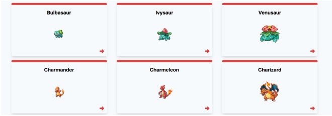

# Proyecto Cuatro API Tabla de Consulta
Instrucciones:
- Crear una Pokedex tomando los datos de la siguiente API https://pokeapi.co/
- Listar los Pokemones en grupos de seis.
- Al momento de refrescar la pagina el grupo de Pokemons debe de cambiar a otro
completamente nuevo y de manera aleatoria
- Al terminar este proyecto subirlo a GitHub y compartirlo a quien corresponda.

## Imagen de Ejemplo

